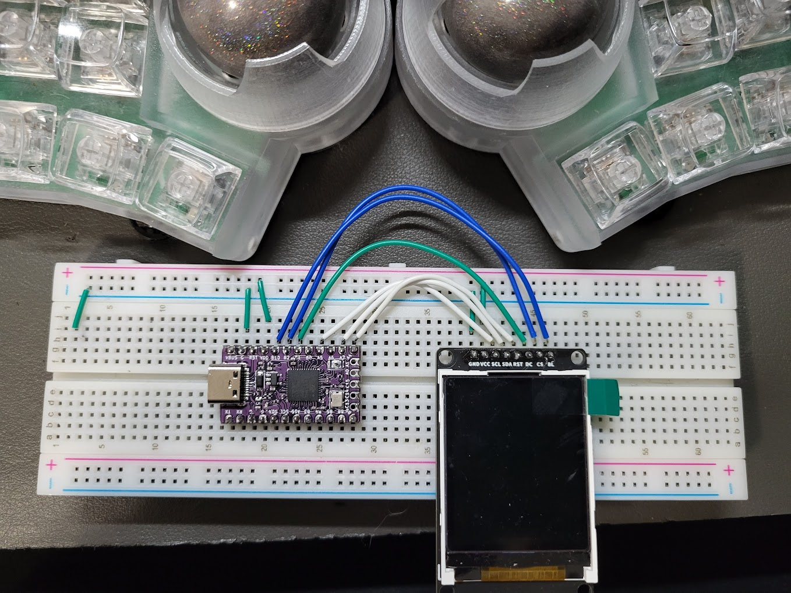

# st7735_test



## build instructions

```
# If you're building with another controller, be sure to look at mcuconf.h and halconf.h to make appropriate adjustments

# run this
make fingerpunch/personal/st7735_test:default CONVERT_TO=stemcell

# take the resulting uf2 and flash, should be 'fingerpunch_personal_st7735_test_default_stemcell.uf2'

# Make sure it's wired up as shown in the image above
```
